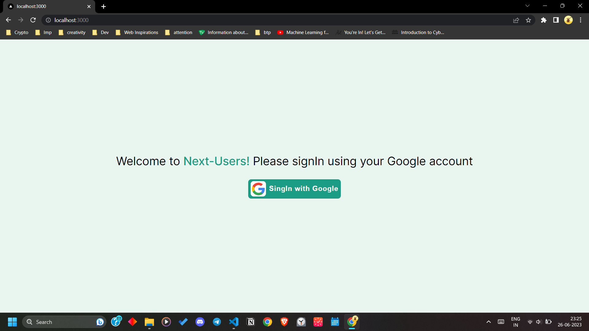
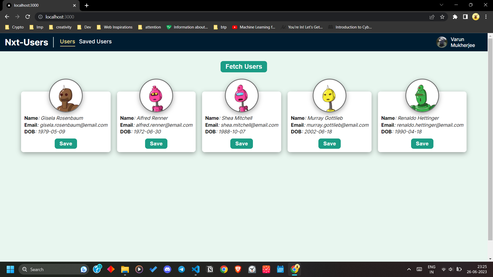
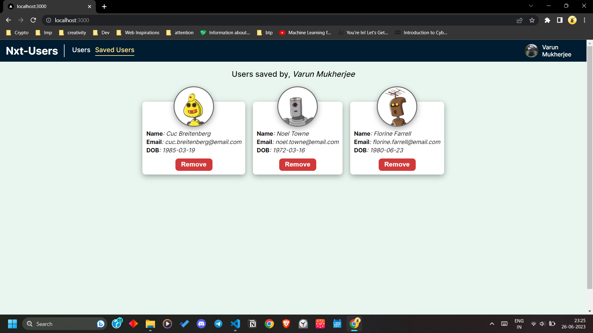

# Next-Users
---

*Next-Users* is a simple Full-Stack Next.js application where we can manage random users in our profile

## \*Technical highlights
---

* **Secured** routes
* **Session** persistence
* **Redux** to manage user data
* User Authentication using **Firebase/ Google-Auth**
* Using **Firestore** as database to store user data
* **User Friendly** interface

## Images
---

